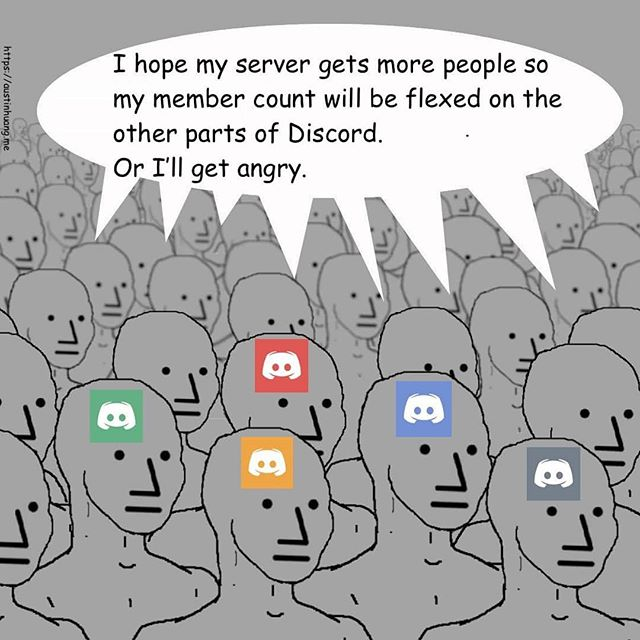

This guide only deals with servers. You can contribute to this page [here](https://github.com/austinhuang0131/austinhuang0131.github.io/blob/master/advertising.md). Use [BotBlock](https://botblock.org/) to find bot lists.

More Discord stuff: [Server Guide](./discord-server-guide) / [Issues](./discord-issues)

* [Websites](#websites)
* [Bots](#bots)
* [Listing Servers](#listing-servers)
* [Subreddits](#subreddits)

### Websites
Sorted by size (Amount of guilds) as of June 26th, 2020. Remember to bump your server regularly to keep your server at the top of rankings.

* [Disboard.org](https://disboard.org/) EN/DE/ES/FIL/FR/NL/PL/PT/SV/TR/RU/JA/KO/ZH
  * 300k+ servers
  * Server owners can bump every 2 hours for free, on site and on bot
  * Allow ratings (stars and text review)
* [DiscordListing.me](https://discordlisting.me)
  * Claims "500k+" but recent bumped suggests 54k+ servers
  * Server owners can bump every 6 hours for free, on site and on bot
  * Free custom link for invites (disli.st)
* [Discord.me](https://discord.me)
  * 46k+ servers
  * Server owners can bump once in every fixed 6-hour periods, on site only. Bumps stack up.
  * Custom link for invites (Discord.me)
  * 1 text-only page for a description and a mini-blog
* [DiscordSL.com](https://discordsl.com/)
  * 25k+ servers
  * Server owners can bump every 3 hours for free, on site only
* [Discord-Server.com](https://discord-server.com) EN/RU/DE/FR/ES/IT/BR
  * 12k+ servers
  * Server owners can bump every 4 hours for free, on site and on bot
* [Discord Server List](https://discordbots.org/servers) <small>Part of <i>top.gg</i></small>
  * 11k+ servers
* [DiscordServers.me](https://discordservers.me/)
  * 11k+ servers
  * No bump, but allows people to upvote
* [Discord Street](https://discord.st)
  * 4k+ servers
  * Server owners can bump once every 6 hours, on site only. Bumps stack up.
* [serverlist.space](https://serverlist.space)
  * 100+ servers
* [Discordeame](https://discordea.net) ES
  * Under 100 servers
* [Discord Extreme List (Servers)](https://discordextremelist.xyz/en-US/servers) EN/DE/HE/TR
  * Just started
  * Open source
* [Discord Servers](https://discordservers.com/)
  * "~40k servers" as of Dec 22 2018, oldest
  * More like a search engine
* [DiscordHub](https://discordhub.com/servers/list)
  * Count unknown
  * Server owners can bump every 1 day (24 hours) for free, on site only
  * **Requires widget!** ([Safety concern](https://www.reddit.com/r/discord_app/comments/94wf4z/regarding_recent_bot_activity_more_info_in/))

**Do NOT use dis.cool.** They scraped "35,000 servers, 12 million users" (according to its owners!) without consent by abusing the widget feature. **Please turn off Widget on your server.** This kind of thing has happened 2 times. We don't want a third.

### Bots
Ordered by server count as of March 24th, 2020.

* [DSC](https://top.gg/bot/415773861486002186) (4000 servers, 2 hour bump interval)
* [ServerMate](https://top.gg/bot/481810078031282176) (3500 servers, 20 minute bump interval)
* [Bump Central](https://top.gg/bot/478290034773196810) (3400 servers, 1 hour bump interval)
* [Open Bump](https://top.gg/bot/546999467887427604) (2900 servers, 1 hour bump interval)
* [HaileyBot](https://top.gg/bot/423637161632464906) (1600 servers, 2 hour bump interval)
* [PYS Bump](https://top.gg/bot/614970561977909251) ( 774 servers, 2 hour bump interval)
<!-- * [Bump Bot](https://discordbots.org/bot/511167075801235478) (325 servers, 24 hour bump interval) // Can not be found on top.gg/discordbots.org -->

### Listing Servers
Aside from websites and bot-served servers. Please note that servers may require you to stay in the server to keep your advertisement. Servers are ordered alphabetically. [This Google spreadsheet by cats#5485](https://docs.google.com/spreadsheets/d/1Ia8VYVrnggQR1Kvb982DzbjZMXjqqrtETPVE9ri7Jag/edit#gid=0) provides a more detailed comparison of various servers. We are only listing the well-maintained ones here.

I will update this list **on request only**.

* [Advertise Your Server](https://discord.gg/RrjdrGQ)
* [Discord Advertising](https://discord.gg/qHACJg3)
* [Discord Growth Portal](https://discord.gg/AG992Gc)
* [Discord Portal](https://discord.gg/KmZETQW)
* [Discord Server Central](http://discord.gg/PrzjCjG)
* [Discord Server Portal™](https://discord.gg/DbZd8pg)
* [Global Advertiser](https://discord.gg/G6qrdU2)
* [Pandora List](https://discord.gg/mU9ezQ2)
* [Saiyan's Advertisements](https://discord.gg/s8dGbpz)
* [Server Advertisement List](http://discord.gg/Gb9gjd3)
* [The Hub](https://discord.gg/dGUC3F6)
* [The Portal](https://discord.gg/6HtGJ98)
* [United Server Listings](https://discord.gg/HbATpW2)
* [Open Advertisements](https://discord.gg/eBFu8HF)
* [Promote Your Servers](https://discord.gg/ZFxYT27)

### Subreddits
Sorted by sub count as of April 16, 2018. Except the listed ones, all others are either new or unmaintained/abandoned.

* [/r/DiscordServers](https://www.reddit.com/r/discordservers/) (7896 subs)
* [/r/nsfwDiscords](https://www.reddit.com/r/nsfwDiscords/) (1461 subs, and as the name says, it's **NSFW**)
* [/r/DiscordAppServers](https://www.reddit.com/r/DiscordAppServers/) (683 subs)
* [/r/MakeDiscordFriends](https://www.reddit.com/r/MakeDiscordFriends/) (329 subs)

**Any reproduction of this guide is forbidden.**


