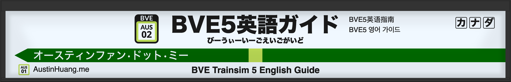

Aight, so hear me out: These train simulators on Steam really cost. Like $30+. Honestly, maybe they're better in the 3D graphics, but BVE Trainsim 5 could score much better in performance than these costly alternatives.

## Install
### Windows
Read official instructions and downloads [here](http://bvets.net/en/download/).

### Mac
Yes, you can run BVE 5 **on a Mac**. Referenced [this blog post](https://kakurasan.blogspot.com/2015/07/bve-trainsim-on-wine.html) (Japanese).

**Known issues:** For certain scenarios (not among the ones introduced below), BVE fails to open *some* .wav files (`Could not open the file`). If you have a solution, please please please leave a comment below.

1. [Get WineBottler.](http://winebottler.kronenberg.org/) (2.0 is fine.) Load the disk image, drag both WineBottler and Wine to the Applications folder. (Non-Sudo people: Or any folder you like - I drag to the Downloads folder. But both apps should be in the same folder. I didn't try otherwise.)
2. [Get BVE 5 WITHOUT INSTALLER.](http://bvets.net/en/download/zip.html) Unzip it.
3. Launch WineBottler.
4. Click Advanced.
5. For Program Installation, select the `BveTs.exe` in the folder.
6. For Installation mode, select "copy file (program) and all files in the folder to the App Bundle."
7. For System Version Info, select 7. (BVE 5 requires Vista or higher.) 64-bit doesn't work because `dotnet35` wouldn't install.
8. You MUST tick "Include Mono". (Or you'll be forced to exit with an error log, as you cannot get `dotnet35`.) "Gecko" doesn't matter.
9. For Winetricks, find the following and tick them: `dotnet35` (MS .NET 3.5), `d3dx9_43` (MS d3dx9_43.dll), and `fakejapanese_ipamona` ("Creates aliases for Japanese fonts using IPAMona fonts"). If you're using BVE under v5.7 (i.e. not newest), you also need `mdx` (Managed DirectX).
10. Tick Silent Install.
11. Press Install, set file name, and go. Takes like 2 minutes to install, then you get an .app bundle. Off you go!

No, I'm not giving you my pre-bundled app. Probably goes against some rules about sharing.

## Basic control
[http://bvets.net/en/drive/index.html](http://bvets.net/en/drive/index.html)

All number keys on that page are Numpad keys, which are useless on Mac (Use your mouse to drag instead). They do not conflict with ATS/ATC stuff below.

## (WIP) Scenarios
Yes yes, I know many English scenarios are made in BVE 4 or OpenBVE. I know [Converter](http://bvets.net/en/download/conv.html) exists, but isn't it better to play scenarios that actually support 5, without the need to solve bugs?
* Windows users: Place all Scenarios in `C:\users\<name>\My Documents\BveTs\Scenarios`.
* Mac users: Place all Scenarios in `/Users/<name>/Documents/BveTs/Scenarios` (which is equivalent to `~/Documents/BveTs/Scenarios`).

All scenarios should contain 1 folder and a bunch of TXT files (Which tells BVE what route to drive) outside the folder. If there's only 1 folder with nothing else, either it's a Vehicle file (I'll indicate) or you forgot to look inside when you unzip. Due to popularity of Shift_JIS encoding in Japan, you should use [The Unarchiver](https://theunarchiver.com/) or any equivalent tools to unzip stuff instead of Archive Utility.

I have tested all the scenarios below. ATS/ATC instructions are included. If errors pop up, "ignore" should be enough. I do not include any scenarios that does not feature scenaries (i.e. no buildings, only grass, etc.).

### List
In no particular order.

* mackoy: [Keisei Chihara Line](#keisei-chihara-line)
* neclgm: [Tama Toshi Monorail](#tama-toshi-monorail) (E) (P)
* wackey: [Keihan Keishin Line](#keihan-keishin-line) (PE) (P)
* reren: [Tokyo Metro Tozai Line](#tokyo-metro-tozai-line) (E) (P)
* Green Shuttle: (P)
  * [Tokyo Metro Hanzomon Line](#trta-then-tokyo-metro-hanzomon-line)
  * [Tokyo Metro Ginza Line](#trta-then-tokyo-metro-ginza-line)
  * Tokyo Metro Fukutoshin Line
  * [Tokyo Monorail](#tokyo-monorail)
* Bluegill77: [Osaka Metro Yotsubashi Line](#osaka-metro-yotsubashi-line) (P)
* Mc220-78:
  * [Osaka Metro Sakaisuji Line](#osaka-metro-sakaisuji-line)
  * [Keihan Ishiyama Sakamoto Line](#keihan-ishiyama-sakamoto-line)
* L53: [Kyoto Municipal Subway Karasuma Line](#kyoto-municipal-subway-karasuma-line)
* L53 / Susubaru: Hankyu lines
* Gigaclone: Shintetsu (Kobe Electric) Arima Line
* Nanairo Project: Keisei Line / Toei Asakusa Line / Keikyu Line / Keikyu Airport Line

#### Legend
* (P): Permission obtained for posting
* (E): Has English version
* (PE): Partially English (Usually station names)
* (A): Has audio issues on Mac (see above)

### Keisei Chihara Line
The official one. Download [here](http://bvets.net/en/download/zip.html), no additional stuff required. Here's a walkthrough:

<iframe width="560" height="315" src="https://www.youtube-nocookie.com/embed/ocRex0a2jUI" frameborder="0" allow="accelerometer; autoplay; encrypted-media; gyroscope; picture-in-picture" allowfullscreen></iframe>

### Tama Toshi Monorail
Download [here](http://neclgm.blog.fc2.com/blog-entry-58.html). Both the page AND THE SCENARIO is **in English**!

* To start the train from the terminus, you'll need to press ATS 0 (S) - ATS 13 (J) - ATS 4 (B2), BEFORE releasing the emergency brake or touching the reverser. Your train WILL NOT MOVE if you don't do so.
  * On Windows, that is <kbd> SPACE </kbd> - <kbd>8</kbd> - <kbd>END</kbd>. You can also press <kbd>Delete</kbd> for a list of key assignments specific to that scenario.
  * On Mac, or if your Windows computer does not have an <kbd>END</kbd> key, you'll need to reassign keys. Right click => Preferences => Input device => Key assignments... => Switches => Find "ATS 4 (B2)" => Press the On/Off box below => Press the key you want to assign (Fn combos accepted, no other combos). If you want to show the in-game key assignment list (Just this game), you'll need to reassign "ATS 2 (A2)" as well. Do note that the in-game key assignment list only shows default assignments.
* Here's a walkthrough:

<iframe width="560" height="315" src="https://www.youtube-nocookie.com/embed/u58bNLPdQew" frameborder="0" allow="accelerometer; autoplay; encrypted-media; gyroscope; picture-in-picture" allowfullscreen></iframe>

### Keihan Keishin Line
Detailed scenary means it's **Resource-Heavy! Requires good GPU!!!**

Download [here](https://www.like-a-lake.com/bve-trainsim5/bve-keihan-keishin-top.html). Find "Mirror site(yahoo box)" and you'll see two columns: The left with Installer, the right without. You'll also see a OneDrive link and a Yahoo Box (Japanese) link.

* Station names are in English. [The manual](https://www.like-a-lake.com/bve-trainsim5/howtodrive-keishin.html) is in Japanese, but the pictures are in English.
* To start the train from the terminus, you'll need to press <kbd>5</kbd> to enable ATS (Or you will not be able to drive - The line does not have ATO), and switch the reverser to the front. Then, **remain on Emergency Brake** until you're told to depart by the screen message (Or ATS will stop you, reason unknown. If you forgot this: Get back on P0 AND Emergency Brake (By pressing <kbd>/</kbd>), then release it again).
* Seriously, **abide speed limit.** This is ATS, not ATC, and Deadman's Switch gets activated extremely often, which will give you a big delay off your schedule.
  * IF there's a red light in the bottom-left corner, you're screwed: You just triggered ATS. To release, Get back on P0 AND Emergency Brake (By pressing <kbd>/</kbd>), then <kbd>6</kbd> (Disable ATS) + <kbd>5</kbd> (Enable ATS).
* Here's a walkthrough:

<iframe width="560" height="315" src="https://www.youtube-nocookie.com/embed/Zcpggd-N0pM" frameborder="0" allow="accelerometer; autoplay; encrypted-media; gyroscope; picture-in-picture" allowfullscreen></iframe>

### Tokyo Metro Tozai Line
Download [here](http://tozai.s77.xrea.com/BVE/ETozai.html#%E8%B7%AF%E7%B7%9A%E3%83%80%E3%82%A6%E3%83%B3%E3%83%AD%E3%83%BC%E3%83%89). Use the English version.

* Vehicles for routes with "(c) vertah" can be downloaded [here](http://vertah.sakura.ne.jp/bvedata/trta05.html). (Scroll to bottom, click the link that says "2013/04/23（05/N05Ver1.1） 123MB". After unzip, merge it with Scenarios folder.) Vehicles for routes with "(c) maihime" lacks interactive functions and is not recommended.
* To start, press <kbd>8</kbd> **ONCE** when remaining in `N (P0) EB`.
* Press <kbd>0</kbd> for speedometer lights, <kbd>9</kbd> for wiper (If train has it).
* Here's a walkthrough for B1373SR:

<iframe width="560" height="315" src="https://www.youtube-nocookie.com/embed/PxGHRRr6fLk" frameborder="0" allow="accelerometer; autoplay; encrypted-media; gyroscope; picture-in-picture" allowfullscreen></iframe>

### TRTA (then-Tokyo Metro) Hanzomon Line
Download [here](http://shtr-m.net/bve/hanzomon.html). Click the first link wrapped by `>><<` in the first heading. Everything's in Japanese.

For this scenario, you'll need to download vehicles.
1. Go [here](http://vertah.sakura.ne.jp/bvedata/train.html).
2. You need 8000, 08, 8590, and 30000. (For TKK 2000, download [here](http://bve.jpn.org/tokyu2000.html) instead, but it's an EXE file. Not tested.)
3. Click the link at the bottom of each box.
4. For 8000: The download link is in the purple box at the bottom of the page. For others: First text link in the second-last box at the bottom.
5. Unzip them and place them in `.../Scenarios/vertah`.

* To start E/B1056T (Red background, brown train) from the overground terminus, you'll need to press <kbd>8</kbd> **ONCE** to enable ATS for Tobu when remaining in `N EB`. Then, after arriving at the first underground station, you'll need to get back to `N EB` and press <kbd>8</kbd> **ONCE** again to enable ATC for Metro.
* To start C/B1367S (Red background, purple train) from the overground terminus, you'll need to press <kbd>8</kbd> **TWICE** to enable ATS for Tobu when remaining in `N EB`. Then, after arriving at the first underground station, you'll need to get back to `N EB` and press <kbd>7</kbd> **ONCE** then <kbd>8</kbd> **ONCE** to enable ATC for Metro.
* To start B952T (No background, brown train) from the underground terminus, you'll need to press <kbd>8</kbd> **TWICE** to enable ATC for metro when remaining in `N EB`.
* To start all other trains from the underground terminus, you'll need to press <kbd>8</kbd> **ONCE** to enable ATC for Metro when remaining in `N EB`.
* B953S is a Not-in-Service train which passes all stations. All others stop at all stations.
* Press <kbd>0</kbd> for speedometer lights, <kbd>9</kbd> for wiper (If train has it).
* Here's a walkthrough for E/B1056T:

<iframe width="560" height="315" src="https://www.youtube-nocookie.com/embed/XDeNjNsnG4I" frameborder="0" allow="accelerometer; autoplay; encrypted-media; gyroscope; picture-in-picture" allowfullscreen></iframe>

### TRTA (then-Tokyo Metro) Ginza Line
Download the route [here](http://shtr-m.net/bve/ginza.html). Click the first link wrapped by `>><<` in the first heading. Everything's in Japanese. You need to [download vehicles](http://vertah.sakura.ne.jp/bvedata/trta01.html) as well and place them in `.../Scenarios/vertah`.

* To start the train, you'll need to press <kbd>8</kbd> **ONCE** to enable ATC for Metro when remaining in `N P0 EB`.
* Press <kbd>0</kbd> for speedometer lights, <kbd>9</kbd> for wiper.
* Here's a walkthrough:

<iframe width="560" height="315" src="https://www.youtube-nocookie.com/embed/tlDv4FQQcd4" frameborder="0" allow="accelerometer; autoplay; encrypted-media; gyroscope; picture-in-picture" allowfullscreen></iframe>

### Tokyo Metro Fukutoshin Line
Under testing...

### Tokyo Monorail
Download the route [here](http://shtr-m.net/bve/tmk.html). Click the first link wrapped by `>><<` in the first heading. Everything's in Japanese. You need to [download vehicles](http://sigf.sakura.ne.jp/bve_tmk1000.html) (Link next to download button) as well.

* An extra vehicle as well as 6 extra scenarios are available [here](http://sigf.sakura.ne.jp/bve_tmk10000.html). Base route pack required.
* ATC is enabled at all times.
* Here's a walkthrough:

<iframe width="560" height="315" src="https://www.youtube-nocookie.com/embed/2uZ46mpW9U8" frameborder="0" allow="accelerometer; autoplay; encrypted-media; gyroscope; picture-in-picture" allowfullscreen></iframe>

### Osaka Metro Yotsubashi Line
Download [here](https://iyoiyokohei.wixsite.com/bluegill77/bveyotsubashi-download). Click the button below "Route".

For the vehicle, download [here](https://yahoo.jp/box/oLvw3q). ([Vehicle documentation](https://tetsudo-1998.jimdo.com/bve/%E8%BB%8A%E4%B8%A1%E3%83%87%E3%83%BC%E3%82%BF/))

* To start the train, you'll need to press <kbd>7</kbd> **ONCE** to enable ATC for Metro when remaining in `N P0 EB`. **DO NOT** press <kbd>7</kbd> or <kbd>8</kbd> again as it'll disable your train (And I don't see a remedy currently without re-opening the scenario).
* Here's a walkthrough:

<iframe width="560" height="315" src="https://www.youtube-nocookie.com/embed/_5xXPNKVxsg" frameborder="0" allow="accelerometer; autoplay; encrypted-media; gyroscope; picture-in-picture" allowfullscreen></iframe>

### Osaka Metro Sakaisuji Line
Download [here](http://mudamc22078.blog.fc2.com/blog-entry-254.html) (link that says BVE5). For vehicle, download [here](https://sites.google.com/view/fwchbve/top/bve%E3%83%87%E3%83%BC%E3%82%BF%E3%83%BC%E5%85%AC%E9%96%8B/%E9%98%AA%E6%80%A510001300%E7%B3%BB). Here's a walkthrough:

<iframe width="560" height="315" src="https://www.youtube-nocookie.com/embed/tPyhxEeobV0" frameborder="0" allow="accelerometer; autoplay; encrypted-media; gyroscope; picture-in-picture" allowfullscreen></iframe>

### Keihan Ishiyama Sakamoto Line
**Not suitable for beginners**

Download [here](http://mudamc22078.blog.fc2.com/blog-entry-272.html). Vehicle included.

* Before departure, and **before switching directions (Neutral), press the** <kbd> SPACE </kbd> **key, and KEEP IT PRESSED!!!** If you release it during your drive, emergency brake will be applied and then you'll need to reset the ATS... (Windows: At neutral-P0-EB, <kbd>HOME</kbd> and <kbd>END</kbd>; Mac: Consider reassigning keys)
* Here's a walkthrough:

<iframe width="560" height="315" src="https://www.youtube-nocookie.com/embed/1ZBJGF014F8" frameborder="0" allow="accelerometer; autoplay; encrypted-media; gyroscope; picture-in-picture" allowfullscreen></iframe>

### Kyoto Municipal Subway Karasuma Line
Download [here](https://blogs.yahoo.co.jp/l53_fmkr/27211920.html). Vehicles included.

* The driver cab graphics for Train 149 is significantly better than Train 145.
* Here's a walkthrough:

<iframe width="560" height="315" src="https://www.youtube-nocookie.com/embed/rWPix3SJKXo" frameborder="0" allow="accelerometer; autoplay; encrypted-media; gyroscope; picture-in-picture" allowfullscreen></iframe>

## Kurumadome (Buffer Stop = End of the Line)
For any issues, please [contact me](https://austinhuang.me/contact) or comment below. I can respond in Mandarin or English. Japanese emails will be accepted (I can read Japanese, didn't I tell you that?) but I'll only reply in English.

Guide text © 2019~ Austin Huang, all rights reserved. Reproduction of this guide is forbidden.

Header made using [Sigene](https://tr246.github.io/Sigene/).

このサイトはリンクフリーです。リンクの際にこのバナー ([フルサイズ](https://raw.ratelimited.me/bqdbu307pq.png) / [200x110](https://raw.ratelimited.me/m0nz6mblsr.png)) にご利用ください。お問い合わせは `im アット austinhuang ドット me` へ（日本語片対応、返信は英語のみ）。


