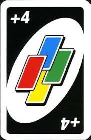

<blockquote>
In my dictionary, there is no place for the word "Rules".
</blockquote>

Hi there! I'm a high school student who [writes JavaScript, operates chatbots](#my-coding-projects), [helps other projects](#projects-i-am-involved-in), [translates websites](#my-translations), [takes photos](#my-photos), studies, and [explores online stuff](#my-other-online-stuff). You may reach me using [these methods](./contact).

If you need a job description, that'll be "high school student/freelance developer".

## My own projects
* [DiscordTel](https://discordtel.austinhuang.me) is a Discord bot that simulates the process of phone dialing on Discord servers. Hosted by [SunburntRock89](https://github.com/SunburntRock89).
* [Metagon](https://metagon.austinhuang.me) is a multi-platform bot that has a lot of useful tools. Hosted on Heroku.
* [Discoin](http://discoin.gitbooks.io/docs) is a currency exchange serving 7 Discord bots. Co-owned with [MacDue](https://github.com/MacDue).
* I also [write private bots](/services) for individuals.
  * I am a part of [ProCord](https://discord.gg/auHudND), a group dedicated in creating free Discord resources that I work for.
  * I am a listed Telegram bot developer in [DevList](http://t.me/devlist).
* I have a [Minecraft server](./minecraft) co-owned with [Michael O](https://michaelo.online). I also maintain a [personal adblock list](/0131-block-list) and [some guides (which are on this site)](./sitemap).

## Projects I am involved in
You can see my [GitHub profile](http://github.com/austinhuang0131). I am currently involved in these projects:

* [Disboard](http://disboard.org/) (Co-Owner)
* [Discord Center](http://discord.center) (Moderator)
* [Discordservers.me](https://discordservers.me/) (Staff)
* [Endless Hosting](http://theendlessweb.com) (Head Support)
* Circuit admin for these Discord listing servers: [Pandora List](https://discord.gg/mU9ezQ2) (Owner), [Discord Server Central](http://discord.gg/PrzjCjG) (Council/Founder), and [Server Advertisement List](http://discord.gg/Gb9gjd3) (Executive).

## My translations
I do some translations occasionally, too, usually from Japanese or Chinese to English. I have done translations in these projects:

* [Disboard](http://disboard.org/) (All of Chinese translation)
* [Weblate](https://hosted.weblate.org/user/austinhuang0131/) projects:
  * 30% of Chinese translation in [Liberapay](https://liberapay.com/)
  * 1% of Chinese translation in [Andor's Trail](https://andorstrail.com/)
  
## My photos

I have a white Pentax K-50. I upload ~~all~~ some ("Good" ones) of my photos on my [Flickr](https://flic.kr/austin0131). Honestly, the 1000 photo rule is more than stupid. I'm planning to move to Zonerama once I can be absolutely sure that they won't do that like Flickr.

## My other online stuff, like social media

<a href="https://instawidget.net/v/user/austinhuang.me" id="link-bf2840a06c81ff33630a7ecce88048809f1bda7467050b99dace8eac2c5c6c60">@austinhuang.me</a>

Instagram on the right.

* [Colnect](https://colnect.com/en/collectors/collector/Austin-Huang): Transit tickets and stuff I collect.
* [Discord](https://discord.gg/8uFr3J3)
* [Google Maps](https://www.google.com/maps/contrib/112274999802772649668/reviews)
* [KeyBase](https://keybase.io/austinhuang) (And this website is [Keybase'd](/keybase.txt))
* [OpenGeofiction](http://opengeofiction.net/user/austinhuang/history): A collaborative platform for creating fictional maps.
* [Public Mobile Community](https://productioncommunity.publicmobile.ca/t5/user/viewprofilepage/user-id/52430) ~~underpaid customer support~~
* [Reddit](http://reddit.com/u/austinhuang)
  * [My /r/KarmaCourt certificate](https://i.imgur.com/dJCyzex.jpg)
* [Snapchat](http://www.snapchat.com/add/austin0131mtl)
* [YouTube](https://www.youtube.com/channel/UCLichN-05sKVoBzDOOCLGcA): A low-effort video storage.

## May I ask some questions?
~~No u.~~ Obviously, sure. You can even comment below to ask even more question, eh?

### Hobbies?

Coding, mapping, commenting on local/global affairs (Some posted on Tumblr), model UN, and listening to sick beats ~~as well as memeing~~ are things I do a lot. And Anime sometimes (≤3 series per year). Skating, softball and badminton, especially, are my favourite sports ~~given that me being a not-so-sporty kid~~.

Yes, I do model UN, even though many people believe I'm the *last* person who would do that. I consider myself more realistic than most people, who are usually idealistic (Probably because their school trained them so for the award). I was memed so hard in MariMUN 2019 that I almost lost all reasons to exist.

<blockquote class="twitter-tweet" data-lang="en">
Is this why Syria can’t get their act together? <a href="https://twitter.com/hashtag/UNHCRMariMUN19?src=hash&amp;ref_src=twsrc%5Etfw">#UNHCRMariMUN19</a> <a href="https://t.co/GUIoWdalVn">pic.twitter.com/GUIoWdalVn</a>
&mdash; Al Jazeera – MARI 2019 (@AJ_MARI2019) <a href="https://twitter.com/AJ_MARI2019/status/1094277224344289288?ref_src=twsrc%5Etfw">2019年2月9日</a></blockquote>

### Hardware?
A school-provided fully-stickered repaired-once MacBook Air (13-inch, 2017) plus several shared VPS from online people ~~comrades~~ and free services. That's it. I mean, after all, I'm not the super-hyped computer science guy anyway. They're hobbies and will remain so.

### You said you're from...Shanghai?
Yeah. I actually went to the same high school as [@simonguozirui](https://github.com/simonguozirui) did and went abroad at the same time as he did, though he's 1 year older than me. But honestly, I know more people in Montréal than in Shanghai.

Oh, and I speak [Shanghainese](https://en.wikipedia.org/wiki/Shanghainese), a dialect of the Wu language, which is a disappearing language.

### What about a formal resume, *please?*

No u. *skirt skirt dab dab*

### Hey, you look cool. How can I support you?
You can [buy my services](/services) or [donate to me](/donate)!

### What other stuff are there on this website?
You can have a look at the [sitemap](/sitemap).


