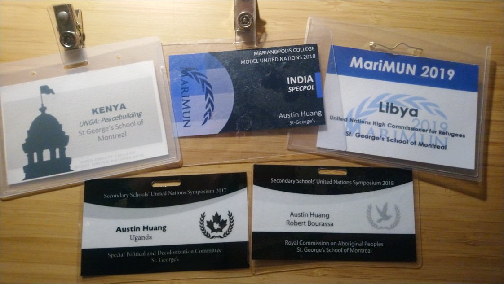

Hi there! I'm a student at McGill University. I [write code](https://github.com/austinhuang0131), [take photos](#my-photos), study, and [explore online stuff](#my-other-online-stuff). You may reach me using [these methods](#hey-you-look-cool). Straight outta the metropolis of Shanghai, China, I currently reside in Montréal, Canada.

If you need a job title, that'll be "university student/freelance project maintainer". I just put everything on my website, it's not actually a *resume*.

## My own projects

### Currently in progress
* I co-founded [DISBOARD](https://disboard.org) and I remain as an Administrator there.

### Founded by me
* [Barinsta](./barinsta.html) was an open source Instagram client on Android that focuses on privacy and well-being. [Cease & Desisted by Facebook.](https://github.com/austinhuang0131/austinhuang0131/issues/2) Got mentioned around the web.
* [Discoin](http://discoin.gitbooks.io/docs) is a currency exchange serving multiple Discord bots. Co-Owned with [PizzaFox](https://jonah.pw).
* [DTel](https://dtel.austinhuang.me) is a Discord bot that simulates the process of phone dialing on Discord servers. Co-Owned with [Mitchell](https://github.com/mitchell3514).
* I made [a school shuttle bus tracker](https://stm.austinhuang.me), mostly for my classmates. (Stagnant due to coronavirus.)

I used to write [private Discord/Telegram bots](/services.html).

## My photos

I have a white Pentax K-50. I upload ~~all~~ some ("Good" ones, due to Flickr's free restrictions) of my photos on my [Flickr](https://flic.kr/austin0131). I'm currently moving most of my photos to [Zonerama](https://austinhuang0131.zonerama.com). I also post loyalty-free ones on [Unsplash](https://unsplash.com/@austinhuang).

## My other online stuff

Guess now I'm deplatformed...

* <a rel="me" href="https://ieji.de/@austin">Mastodon</a> (`@austin@ieji.de`)
* [OpenGeofiction](http://opengeofiction.net/user/austinhuang/history): A collaborative platform for creating fictional maps.
* [Pixiv](https://pixiv.me/montreal0131): A collection of illustrations I like.
* [Reddit](http://reddit.com/u/austinhuang)
  * [My /r/KarmaCourt certificate](https://i.imgur.com/dJCyzex.jpg)
* [YourWorldOfText](https://www.yourworldoftext.com/~austinhuang/): Ask me questions here!
* [Tumblr](https://blog.austinhuang.me) (inactive)

## May I ask some questions?
Sure. You can even comment below to ask even more questions, eh?

### Hobbies?
Coding, mapping (or, more professionally, *urban planning*), commenting on local/global affairs, model UN, and listening to some beats (80~90s/country/jazz/blues/memes/news intro, also classical/organ remixes... But I hate the new funky stuff. Gross.) ~~as well as memeing~~ are things I do a lot. Watches some anime (less than 4 series per year).

#### Model UN?

Model UN is great. Strongly recommended. Even if you're not into politics, this giant social-party atmosphere will pull you into this extravaganza, and also allows you to meet some of the best people you'll ever make friends with! (It is quite expensive though, would like to see it becoming more affordable, but eh.)

### Hardware?
A school-provided (now owned) fully-stickered repaired-once MacBook Air (13-inch, 2017) plus several shared VPS from online people ~~comrades~~ and free services. That's it.

My phone is a Sony Xperia XA2, model H3123.

### You from Shanghai?
Glad you asked! I'm proud of my Shanghainese heritage. Also, I speak Shanghainese!

### This site?
I try to use components from responsible sources. [No Cloudflare.](http://www.crimeflare.org:82/) [No Google.](https://nomoregoogle.com/) No cookies. *No problemo.*

* The pages are [on GitHub](https://github.com/austinhuang0131/austinhuang0131.github.io). Powered by Jekyll with [HydeJack](https://hydejack.com/) theme.
* The domain is registered by [Vondelphia](https://von.enterprises/aff.php?aff=1870) (affiliate link).
* I use nameservers from [deSec.io](https://desec.io).
* I use analytics from [GoatCounter](https://goatcounter.com). Here are [public stats for this website](https://0131.goatcounter.com).

### Hey, you look cool.
You can contact me:

* [Email](mailto:im@austinhuang.me): `im@austinhuang.me`. My PGP public key is available through most public keyservers or [here](./assets/key.asc). Do NOT use Keybase key (It has been revoked outside Keybase). I may not respond from the same email address.
* [Matrix](https://matrix.to/#/@austin:tchncs.de): `@austin:tchncs.de`
* [Telegram](http://t.me/austinhuang): `@austinhuang`
* [Discord](https://discord.com/users/207484517898780672): `The Double-Eyed Bus#6889`
* [Threema](https://threema.id/94XSDZ98): `94XSDZ98`

You can also [donate to me](/donate.html)!

### What other stuff are there on this website?
You can have a look at the sidebar.

Fun fact:

* This page is featured on [Hydejack's showcase](https://hydejack.com/showcase/)!
* This page is available on [IPFS](https://ipfs.io/) (with [DNSLink](https://docs.ipfs.io/concepts/dnslink/) pointed at `austinhuang.me`). Try with your local node!
