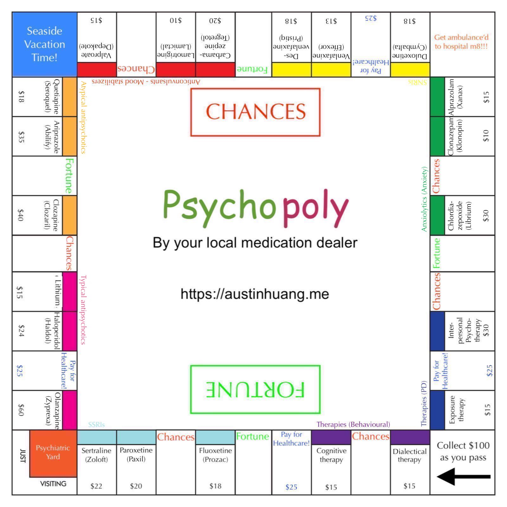

Cringe warning. Viewer discretion is advised. Feedbacks are [always welcomed](./contact).

[Original project rubric.](https://photos.app.goo.gl/j9fvUZRVGsNnkxjd6)

## Rules
1. Y’all teenagers.
2. You buy rights to a drug.
3. If you’re diagnosed with a certain disease, 
    1. You pay 50% of the sum of all drugs in a corresponding type, to the owners
        1. If all drugs of the same category are owned by the same player, you pay 75%
    2. If you played 3 rounds with disease, you go to psychiatric yard
        1. You still need to pay off your medications.
        2. Roll a double OR pay $10 to get out of psychiatric yard.
4. 1 person broke, everyone loses, as it is assumed that one person’s loss will affect all of their friends.
5. 3-doubles go-to-jail rule doesn’t apply as it is replaced by 2.2.
6. Trade as usual, feel free to take pity - Remember, the original Monopoly is supposed to teach us about empathy, not greed! See https://qz.com/1036007 

## Chances
1. Your teachers got really angry at you due to recent low marks… NARCISSISTIC PD
2. You’re going on a date but an armed man kidnapped you… SCHIZOPHRENIA
3. You got a lift in the rain! Go to GO block and collect your start bonus.
4. Mental breakdown over your friend and… YOU GOT TAGGED WITH BEING PSYCHO! Hospital time

## Fortune
1. Government research breakthrough, remove 1 disease
2. Hospital scandal! 1 out-of-jail card
3. Generous donation! $50 every player
4. Misdiagnosis! Remove 1 disease

## Note
I chose board game as a format as it lets you feel the story, instead of just telling someone’s POV, like these videos. A two-way experience is better than being presented with facts. To address each point ([As written here](https://photos.app.goo.gl/j9fvUZRVGsNnkxjd6)):

1. Drugs are separated to a disorder, but they are interchangeable, so it addresses them generally.
2. You may feel like Chances are exaggerated, but it’s not like they are impossible. Things could hit hard at times and they could be unexpected
3. It’s a chance. You can’t avoid probability.
4. This actually shows a lack of control since the society, while already did good, still has a long way to go in bringing the ill people back to normal. I believe this could encourage changes.
